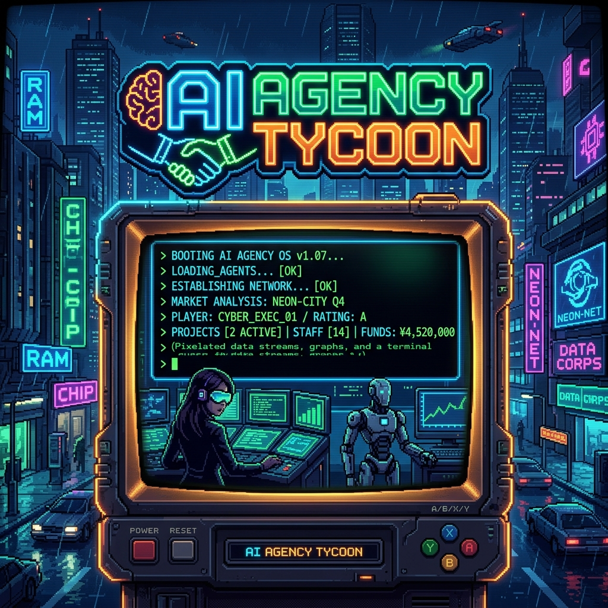

# 🎮 AI Agency Tycoon v1.0.0



**AI Agency Tycoon**, tek başınıza sıfırdan başlayıp aylık **$40,000 MRR (Aylık Tekrarlayan Gelir)** ve **30 aktif müşteri** hedefine ulaşmaya çalıştığınız retro-cyberpunk temalı bir metin tabanlı (terminal) simülasyon ve tycoon oyunudur. 

Oyun, Mert'in **"AI Ajansı Framework (30 Müşteri & 40K MRR)"** rehberindeki pratik ve stratejik adımları temel alarak tasarlanmıştır.

---

## 🚀 Özellikler

- **CRT ve Neon Cyberpunk Arayüzü:** 80'lerin retro terminal ekranlarını andıran scanline ve CRT titreme efektleriyle süslenmiş interaktif bir arayüz.
- **Dinamik Seviye Sistemi (Level 0 - Level 7):** Temel hazırlıklardan niş seçimine, outbound satışlardan sanal asistan (VA) delegasyonuna kadar 8 farklı büyüme aşaması.
- **İnteraktif Demo Call (Satış Görüşmesi) Simülatörü:** Potansiyel müşterilerle 15 dakikalık birebir satış görüşmeleri yapın. İtirazları yönetin, para iade garantisi verin ve satışı kapatın!
- **Otomasyon ve Kaldıraç Mekanikleri:** n8n/Make entegrasyonları ile operasyonel süreleri kısaltın, Stripe Atlas/Wise ile global ödeme altyapısı kurun.
- **Detaylı Finans ve Tükenmişlik (Burnout) Yönetimi:** Gelirlerinizi, nakit rezervlerinizi, haftalık çalışma saatlerinizi ve burnout oranınızı dengede tutun.
- **Başarımlar ve Rozetler:** "Temel Hazır", "Yerel Fatih", "Otomasyon Sihirbazı", "Kurt Satıcı", "Global Oyuncu" ve "SaaS Visionary" gibi 8+ özel başarımı açın.

---

## 🛠️ Teknolojiler

Bu proje tamamen modern web standartları ve bağımlılıksız (Vanilla) teknolojiler kullanılarak geliştirilmiştir:

- **HTML5 & CSS3:** Özelleştirilmiş neon HSL renk paletleri, glassmorphism kart tasarımları ve CRT scanline animasyonları.
- **Vanilla JavaScript:** Oyun motoru, durum yönetimi (state), CLI komut ayrıştırıcı ve animasyonlar.
- **FontAwesome & Google Fonts:** Retro dijital hissi için *Share Tech Mono*, *VT323* ve *Fira Code* yazı tipleri.
- **HTML5 Canvas:** Seviye geçişlerinde ve başarılarda tetiklenen dinamik konfeti efekti.

---

## 🎮 Nasıl Oynanır?

Oyunu çalıştırmak son derece basittir. Herhangi bir derleme veya sunucu kurulumuna ihtiyaç duymaz:

1. Bu depoyu klonlayın:
   ```bash
   git clone https://github.com/workyghost/ai-agency-game.git
   ```
2. Proje dizinine gidin ve `index.html` dosyasını tarayıcınızda çift tıklayarak açın.
3. Alternatif olarak, bir yerel geliştirme sunucusu (Live Server vb.) ile başlatabilirsiniz.

### Kullanılabilir Terminal Komutları

Oyunu sağ tarafta bulunan terminal penceresine aşağıdaki komutları yazarak kontrol edebilirsiniz:

| Komut | Açıklama |
| :--- | :--- |
| `help` | Kullanılabilir tüm komutların listesini ve açıklamalarını gösterir. |
| `status` | Ajansınızın finansal durum, müşteri sayısı, çalışma saati ve bekleyen demo detaylarını raporlar. |
| `select-niche [niche-id]` | Seviye 1'de odaklanacağınız sektörü seçer (`local-service`, `ecommerce`, `b2b-saas`). |
| `automate-ops` | Süreçlerinizi otomatize etmek için şablonlar kurar (n8n/Make). |
| `send-outbound [tr\|int]` | TR veya Global pazarlara yönelik soğuk erişim (cold outreach) kampanyası başlatır. |
| `run-demo-call [tr\|int]` | Bekleyen demo görüşmelerini başlatarak interaktif satış simülasyonunu açar. |
| `outbound-templates` | Başarılı ve başarısız cold outreach mesaj şablonlarını analiz eder. |
| `hire-va` | Operasyonel yükü delege etmek için Sanal Asistan (VA) işe alır (Seviye 6). |
| `next-month` | Sonraki aya geçer. Gelir/giderleri günceller, burnout seviyesini hesaplar ve seviye atlatır. |
| `clear` | Terminal ekranını temizler. |

---

## 📁 Dosya Yapısı

```text
├── index.html          # CRT terminali ve metrik panellerinin bulunduğu ana arayüz
├── style.css           # Retro cyberpunk teması, neon efektler ve scanline animasyonları
├── app.js              # Oyun döngüsü, komut sistemi ve arayüz güncellemeleri (Core Engine)
├── content.js          # Seviyeler, diyalog ağaçları, başarımlar ve outreach şablonları
├── cover.png           # Yapay zeka ile üretilmiş pixel-art oyun kapak görseli
├── extract_pdf.py      # Framework PDF'inden veri okuma/ayıklama aracı
├── run_test.py         # Test ve doğrulama betiği
└── README.md           # Proje tanıtım ve kılavuz belgesi
```

---

## 🏆 Başarı Kriteri

Oyunu kazanmak için:
1. **30 Aktif Müşteriye** ulaşın.
2. Aylık **$40,000 MRR** sınırını aşın.
3. Son Seviye olan **Level 7: Karar Anı** aşamasına gelerek ajansınızın geleceğini belirleyin (SaaS Pivot, Kurumsal Ölçeklenme veya Solo İmparatorluk).

*Dikkat:* Haftalık çalışma saatiniz 40 saatin üzerine çıktıkça **Burnout (Tükenmişlik)** seviyeniz artar. Burnout %100'e ulaştığında ajansınız çöker! Bu yüzden otomasyonları kurmayı ve sanal asistan işe almayı unutmayın.

---

*Bol kazançlar, geleceğin AI Tycoon'u!* 🚀
