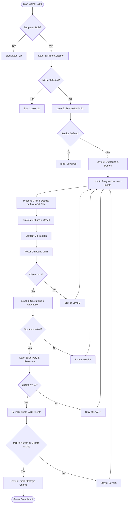

# AI Agency Tycoon - Comprehensive Codebase Audit & QA Report

This document presents a complete, end-to-end codebase audit of the **AI Agency Tycoon** project (`c:/Users/murat/Desktop/ai-agency`). It details major game-blocking logic deadlocks, checks compliance with the official PDF agency-building framework, audits financial/operational formulas, evaluates UI/UX quality, and provides exact, copy-pasteable CSS/JS code changes.

---

## Game Flow Architecture

The following flowchart illustrates the corrected game loop and level progression structure, ensuring that Level-Up requirements do not block the monthly financial engine:



---

## 1. Interface & Scroll Bug Diagnostics

### Issue Analysis
When new text lines are printed in the terminal or typed by the player, the output log does not automatically scroll down to display the latest messages. This is caused by a mismatch in height constraints and target elements in the scrolling logic.

1. **DOM Structure (`index.html`)**:
   ```html
   <div class="terminal-body" id="terminal-body">
       <div class="terminal-output" id="terminal-output">
           <!-- Log lines appended here -->
       </div>
       <div class="terminal-input-line">
           <!-- Input prompt and field -->
       </div>
   </div>
   ```

2. **CSS Layout (`style.css`)**:
   - `.terminal-body` is styled with `overflow-y: auto`.
   - `.terminal-output` is styled with `flex: 1` and `overflow-y: auto`.
   
   Because `.terminal-output` has `flex: 1` and handles its own internal overflow (`overflow-y: auto`), it stays constrained within the height of `.terminal-body`. The log text overflows *inside* `.terminal-output`, while `.terminal-body` itself remains at its default height without overflowing.

3. **Javascript Scroll Targeting (`app.js`)**:
   In `TerminalManager`, print operations resolve their scroll position using:
   ```javascript
   const parentContainer = this.container.parentElement; // Resolves to #terminal-body
   if (parentContainer) {
       parentContainer.scrollTop = parentContainer.scrollHeight;
   }
   ```
   - **The Bug**: The code attempts to scroll the parent (`#terminal-body`). However, `#terminal-body` is not the element overflowing—`#terminal-output` (`this.container`) is. Therefore, updating `.scrollTop` on `#terminal-body` has no effect. The actual scroll area (`#terminal-output`) remains stuck at the top, hiding new outputs.
   - **Double-Scroll Conflict**: Since both elements have `overflow-y: auto`, any sizing mismatch or margin overflow (e.g., from `.terminal-input-line`) causes both containers to display scrollbars. If `.terminal-body` scrolls, the command input line gets pushed downwards and out of view, forcing the user to manually scroll the entire panel to see their input.

### Actionable Fixes

#### A. CSS Layout Adjustments (`style.css`)
- Remove `overflow-y: auto` from `.terminal-body` and set it to `overflow: hidden`. This locks the terminal container size and prevents the input prompt from sliding off-screen.
- Remove `scroll-behavior: smooth` from `.terminal-output`. In standard terminals, typewriter outputs and console prints scroll instantly. Smooth scrolling clashes with the rapid character-by-character updates (10ms delay), creating sluggish rendering.

```diff
 .terminal-body {
     flex: 1;
     display: flex;
     flex-direction: column;
     background: rgba(3, 6, 12, 0.95);
     padding: 15px;
-    overflow-y: auto;
+    overflow: hidden;
     font-family: var(--font-mono);
 }
 
 .terminal-output {
     flex: 1;
     display: flex;
     flex-direction: column;
     gap: 8px;
     overflow-y: auto;
     margin-bottom: 15px;
-    scroll-behavior: smooth;
     padding-right: 5px;
 }
```

#### B. Scroll Code Corrections (`app.js`)
- Update `TerminalManager` to scroll `this.container` (`#terminal-output`) directly.

```diff
     this.container.appendChild(line);
 
     // Auto-scroll as we print
-    const parentContainer = this.container.parentElement;
-    if (parentContainer) {
-      parentContainer.scrollTop = parentContainer.scrollHeight;
-    }
+    this.container.scrollTop = this.container.scrollHeight;
 
     // Typewriter effect character by character
     for (let i = 0; i < text.length; i++) {
       line.textContent += text.charAt(i);
-      if (parentContainer) {
-        parentContainer.scrollTop = parentContainer.scrollHeight;
-      }
+      this.container.scrollTop = this.container.scrollHeight;
       await new Promise(r => setTimeout(r, this.speed));
     }
```

---

## 2. Dialogue System Disconnect (Mismatched Structures)

### Issue Analysis
There is a structural mismatch between the educational content in `content.js` and the execution parser in `app.js`.
- **Naming Mismatch**: `content.js` declares `window.GAME_CONTENT.demoCallDialog`, while `app.js` checks for `window.GAME_CONTENT.dialogues.demoCall` (throwing a silent error and falling back to hardcoded data).
- **Structure Incompatibility**: `content.js` defines dialogues as a **branching graph** (using custom nodes and `nextNode` strings), while `app.js` executes dialogues as a **linear array of steps** (using integer indexing like `state.demoCallStep++`). Connecting the keys without fixing this parser will crash the game.

### Actionable Fix
Refactor `app.js`'s dialogue handlers to traverse the graph-like node structure while maintaining the simple linear array as a fallback.

```javascript
function startDemoCall(clientType, lang) {
  state.inDemoCall = true;
  state.demoCallStep = 'greeting'; // Set to the root graph node
  state.demoCallScore = 0;
  state.demoCallClientType = clientType;

  renderDemoCallStep();
}

function renderDemoCallStep() {
  const lang = state.demoCallClientType.startsWith('tr') ? 'tr' : 'en';
  const dialogueSource = (window.GAME_CONTENT && window.GAME_CONTENT.demoCallDialog) 
    ? window.GAME_CONTENT.demoCallDialog 
    : null;

  if (dialogueSource && dialogueSource.nodes && dialogueSource.nodes[state.demoCallStep]) {
    const currentNode = dialogueSource.nodes[state.demoCallStep];
    term.print(currentNode.customerStatement, 'dialogue');
    currentNode.choices.forEach((choice, index) => {
      term.print(`${index + 1}) ${choice.text}`, 'dialogue-option');
    });
    term.print("Seçiminiz (1-3 veya çıkmak için 'iptal'):", "system");
  } else {
    // Linear Fallback
    const currentList = FALLBACK_DIALOGUES[lang];
    const step = currentList.steps[state.demoCallStep];
    term.print(step.text, 'dialogue');
    step.choices.forEach((choice, index) => {
      term.print(`${index + 1}) ${choice.text}`, 'dialogue-option');
    });
    term.print("Seçiminiz (1-3 veya çıkmak için 'iptal'):", "system");
  }
}

async function handleDemoCallDialogue(input) {
  const cleanInput = input.trim();
  const lang = state.demoCallClientType.startsWith('tr') ? 'tr' : 'en';

  if (cleanInput.toLowerCase() === 'iptal') {
    await term.print("Görüşme iptal edildi.", "error");
    if (state.demoCallClientType.startsWith('tr')) {
      state.demoQueue.tr = Math.max(0, state.demoQueue.tr - 1);
    } else {
      state.demoQueue.int = Math.max(0, state.demoQueue.int - 1);
    }
    state.inDemoCall = false;
    updateUI();
    return;
  }

  const choiceIndex = parseInt(cleanInput) - 1;
  if (isNaN(choiceIndex) || choiceIndex < 0 || choiceIndex > 2) {
    await term.print("Geçersiz seçim! 1, 2 veya 3 yazın.", "error");
    return;
  }

  const dialogueSource = (window.GAME_CONTENT && window.GAME_CONTENT.demoCallDialog) 
    ? window.GAME_CONTENT.demoCallDialog 
    : null;

  if (dialogueSource && dialogueSource.nodes && dialogueSource.nodes[state.demoCallStep]) {
    const currentNode = dialogueSource.nodes[state.demoCallStep];
    const choice = currentNode.choices[choiceIndex];

    state.demoCallScore += choice.score;
    await term.print(`> ${choice.text}`, 'input');
    
    if (choice.feedback) {
      await term.print(`[GERİ BİLDİRİM] ${choice.feedback}`, 'system');
    }

    const nextNodeKey = choice.nextNode;
    const nextNode = dialogueSource.nodes[nextNodeKey];

    if (nextNode && nextNode.isEnd) {
      state.inDemoCall = false;
      await term.print(`\n${nextNode.message}`, nextNode.success ? 'success' : 'error');

      if (nextNode.success) {
        state.clients[state.demoCallClientType]++;
        const prices = state.currentNiche ? niches[state.currentNiche].prices : niches['local-service'].prices;
        const gainedRevenue = prices[state.demoCallClientType];
        await term.print(`Yeni Müşteri Edinildi! Aylık Gelir: +$${gainedRevenue.toLocaleString()} eklendi.`, "success");
        triggerConfetti();
        
        const totalClients = 
          state.clients.trStandard + state.clients.trPremium + 
          state.clients.intStandard + state.clients.intPremium;
        if (totalClients === 1) {
          unlockBadge('first_client');
        }
      }

      if (state.demoCallClientType.startsWith('tr')) {
        state.demoQueue.tr = Math.max(0, state.demoQueue.tr - 1);
      } else {
        state.demoQueue.int = Math.max(0, state.demoQueue.int - 1);
      }

      recalculateMRR();
      calculateWorkingHours();
      updateUI();
    } else {
      state.demoCallStep = nextNodeKey;
      renderDemoCallStep();
    }
  } else {
    // Linear Fallback Logic
    const currentList = FALLBACK_DIALOGUES[lang];
    const step = currentList.steps[state.demoCallStep];
    const choice = step.choices[choiceIndex];

    state.demoCallScore += choice.score;
    await term.print(`> ${choice.text}`, 'input');
    await term.print(choice.response, 'dialogue');

    state.demoCallStep++;

    if (state.demoCallStep < currentList.steps.length) {
      renderDemoCallStep();
    } else {
      state.inDemoCall = false;
      if (state.demoCallScore >= 20) {
        state.clients[state.demoCallClientType]++;
        await term.print("\n[BAŞARILI] Müşteri ile anlaştınız!", "success");
        const prices = state.currentNiche ? niches[state.currentNiche].prices : niches['local-service'].prices;
        state.mrr += prices[state.demoCallClientType];
        triggerConfetti();
      } else {
        await term.print("\n[BAŞARISIZ] Müşteri kabul etmedi.", "error");
      }

      if (state.demoCallClientType.startsWith('tr')) {
        state.demoQueue.tr = Math.max(0, state.demoQueue.tr - 1);
      } else {
        state.demoQueue.int = Math.max(0, state.demoQueue.int - 1);
      }
      recalculateMRR();
      calculateWorkingHours();
      updateUI();
    }
  }
}
```

---

## 3. Game-Breaking Logic Deadlock (Level Up vs. Month Transition)

### Issue Analysis
The `nextMonthCommand` checks if the player qualifies to level up. If the criteria are not met, the command executes an early `return`.
- **The Deadlock**: At Level 3, the player needs at least 1 client to progress. At Level 5, they need 10 clients. 
- If a player has fewer than 10 clients in Level 5 and types `next-month` (expecting to process monthly financials, receive monthly MRR to pay expenses, and reset the outbound limits so they can search for more clients), the code hits the Level 5 check, prints an error, and **returns immediately**.
- Because of this early return, the month progression never executes. The player cannot reset `state.outboundSentThisMonth`, and they cannot run any more outbound campaigns to find clients. The game loop freezes permanently.

### Actionable Fix
Decouple level upgrades from month transitions. When `next-month` is run, calculate level promotions. If the level does not change, **do not block the month transition** (except for Levels 0, 1, and 2, which represent pre-sales setups).

```javascript
async function nextMonthCommand() {
  const totalClients = 
    state.clients.trStandard + state.clients.trPremium + 
    state.clients.intStandard + state.clients.intPremium;

  // 1. Level Promotion Calculations (No return statements for Lvl 3+)
  if (state.level === 0) {
    if (!state.templatesCreated) {
      await term.print("Level 1'e geçiş başarısız. Önce `automate-ops` ile şablonlarınızı hazırlayın.", "error");
      return;
    }
    state.level = 1;
    await term.print("Tebrikler! Level 1: NİŞ SEÇİMİ aşamasına geçtiniz.", "success");
    await term.print("Odak sektörü (niş) seçin: `select-niche [local-service|ecommerce|b2b-saas]`", "system");
    triggerConfetti();
    showLevelUpModal(1);
    unlockBadge('template_builder');
    return;
  }

  if (state.level === 1) {
    if (!state.currentNiche) {
      await term.print("Level 2'ye geçiş başarısız. Önce `select-niche` ile bir odak sektörü seçmelisiniz.", "error");
      return;
    }
    state.level = 2;
    await term.print("Tebrikler! Level 2: HİZMET TANIMLAMA aşamasına geçtiniz.", "success");
    await term.print("Standart paketlerinizi tanımlamak için `automate-ops` çalıştırın.", "system");
    triggerConfetti();
    showLevelUpModal(2);
    unlockBadge('niche_master');
    return;
  }

  if (state.level === 2) {
    if (!state.serviceDefined) {
      await term.print("Level 3'e geçiş başarısız. Önce `automate-ops` ile hizmet paketlerini tanımlamalısınız.", "error");
      return;
    }
    state.level = 3;
    await term.print("Tebrikler! Level 3: MÜŞTERİ YAKALAMA aşamasına geçtiniz.", "success");
    await term.print("Outbound reklam başlatın (`send-outbound`) ve demoları yapın (`run-demo-call`).", "system");
    triggerConfetti();
    showLevelUpModal(3);
    return;
  }

  // Active Sandbox Levels (Levels 3, 4, 5, 6): Upgrade Level if qualified, but NEVER block month transitions
  if (state.level === 3) {
    if (totalClients >= 1) {
      state.level = 4;
      await term.print("Tebrikler! Level 4: OPERATIONS aşamasına geçtiniz. Otomasyon kurun (`automate-ops`).", "success");
      triggerConfetti();
      showLevelUpModal(4);
      unlockBadge('first_client');
    }
  }
  else if (state.level === 4) {
    if (state.operationsAutomated) {
      state.level = 5;
      await term.print("Tebrikler! Level 5: DELIVERY & RETENTION aşamasına geçtiniz.", "success");
      triggerConfetti();
      showLevelUpModal(5);
      unlockBadge('automation_wizard');
    }
  }
  else if (state.level === 5) {
    if (totalClients >= 10) {
      state.level = 6;
      await term.print("Tebrikler! Level 6: SCALE TO 30 CLIENTS aşamasına geçtiniz. Sanal asistan alabilirsiniz (`hire-va`).", "success");
      triggerConfetti();
      showLevelUpModal(6);
    }
  }
  else if (state.level === 6) {
    if (state.mrr >= 40000 || totalClients >= 30) {
      state.level = 7;
      state.inEndDecision = true;
      await term.print("=== TEBRİKLER! AJANS DEVİ OLDUNUZ! ===", "success");
      await term.print("Seçenekler: sustain / team / saas", "dialogue-option");
      triggerConfetti();
      showLevelUpModal(7);
      unlockBadge('tycoon_status');
      return;
    }
  }

  // 2. Month Financial & Operations Processing (Runs every month for sandbox phases)
  await term.print(`\n=== AY ${state.month} ÖZETİ VE RAPORU ===`, "system");
  state.cash += state.mrr;
  await term.print(`+ Gelir (MRR): +$${state.mrr.toLocaleString()}`, "success");

  const expenses = getMonthlyExpenses();
  state.cash -= expenses;
  await term.print(`- Giderler (Yazılım/VA): -$${expenses.toLocaleString()}`, "error");
  await term.print(`Net Nakit Bakiye: $${state.cash.toLocaleString()}`, "system");

  // Process Churn, Burnout, and reset monthly flags
  ...
```

---

## 4. Economic Balance & Exploit Controls

### Outbound Spamming Exploit
- **The Issue**: In `sendOutboundCommand`, the command does not verify whether `state.outboundSentThisMonth` is already `true`.
- **The Exploit**: A player can execute `send-outbound` multiple times within a single month, spawning infinite demo calls in their queue as long as they have cash. The workload penalty is only applied once when transitioning the month.
- **The Fix**: Add a verification block at the beginning of `sendOutboundCommand`:

```javascript
async function sendOutboundCommand(args) {
  if (state.level < 3) {
    await term.print("Hata: Outbound kampanyaları başlatmak için en az Level 3 aşamasında olmalısınız.", "error");
    return;
  }

  if (state.outboundSentThisMonth) {
    await term.print("Hata: Bu ay zaten bir outbound kampanyası yürüttünüz. Yeni kampanya için sonraki aya geçmelisiniz.", "error");
    return;
  }
  
  // Proceed with campaign costs and setup...
```

---

## 5. UI/UX Quality & Accessibility Improvements

### Stacking Panels for Mobile
The current CSS grid breaks on screens smaller than 768px. Stacking panels ensures a clean layout for mobile users:
```css
@media (max-width: 768px) {
    .workspace-grid {
        grid-template-columns: 1fr;
        height: auto;
        overflow-y: auto;
    }
    .app-container {
        height: auto;
        overflow-y: auto;
    }
}
```

### Accessibility: CRT Flicker Toggle
The CRT glow and scanning lines look great, but the infinite flicker animation can cause eye strain. Adding a toggle in the header solves this:
- **HTML (Add to `.header-status`)**:
  ```html
  <button id="toggle-crt-btn" class="text-btn" style="margin-left: 10px;">CRT_OFF()</button>
  ```
- **Javascript (`app.js`)**:
  ```javascript
  const crtBtn = document.getElementById('toggle-crt-btn');
  crtBtn.addEventListener('click', () => {
    document.body.classList.toggle('crt-effects');
    crtBtn.textContent = document.body.classList.contains('crt-effects') ? 'CRT_OFF()' : 'CRT_ON()';
  });
  ```

---

## 6. Player Onboarding & Educational Content Integration

1. **Starting Metrics Sync**: Change the initial level and title in `index.html` (lines 52–53) from Level `01 / Junior Dev Agency` to `00 / Pre-Launch Rookie` to prevent layout flicker.
2. **Document Pricing Tiers**: Modify the help text to display the costs of outbound tracks so players can plan their cash budgets:
   - `automate-ops` (Lvl 0: $100 | Lvl 2: $150 | Lvl 4: $300)
   - `send-outbound [tr|int]` (Lvl 3+, Cost: tr=$50, int=$150, both=$200)
3. **Win/Loss Transparency**: In the initial welcome logs printed at load, clearly write the win conditions ($40K MRR or 30 clients) and loss triggers (Burnout >= 100% or Cash < $0) so players know the boundaries.
4. **Display Educational Templates**: Add an `outbound-templates` command to display the high-performing email pitches and bad pitch anti-patterns stored in `content.js`, making the game highly educational:
   ```javascript
   // Add this to parseCommand switch-case:
   // case 'outbound-templates':
   //   await showTemplates();
   //   break;

   async function showTemplates() {
     const src = (window.GAME_CONTENT && window.GAME_CONTENT.outboundTemplates) 
       ? window.GAME_CONTENT.outboundTemplates 
       : null;
     if (!src) {
       await term.print("Hata: Şablon içeriği yüklenemedi.", "error");
       return;
     }
     await term.print(`=== ${src.title} ===`, 'system');
     await term.print(src.description, 'system');
     for (const t of src.templates) {
       await term.print(`\n[Varyant: ${t.id}] - ${t.type} (${t.language})`, 'dialogue-option');
       await term.print(`Kanal: ${t.channel}`, 'system');
       await term.print(`Mesaj:\n${t.content}`, 'dialogue');
       await term.print(`Analiz: ${t.analysis}`, 'system');
     }
   }
   ```
5. **Levels & Achievements Unused Content**:
   Note that `window.GAME_CONTENT.levels` and `window.GAME_CONTENT.badges` are completely ignored by `app.js` (which uses internal copies). To resolve this and clean up redundancy, `app.js` should dynamically render goals and badge lists using `window.GAME_CONTENT` directly.
